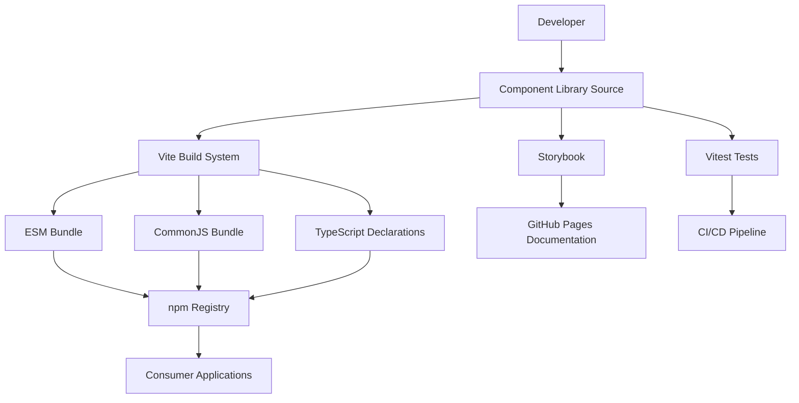

# ZyFAi Component Library - Frontend Architecture Document

## Introduction

This document outlines the frontend architecture for the ZyFAi-inspired component library, focusing on React components with glassmorphism design patterns. The architecture emphasizes accessibility, performance, and developer experience while replicating the sophisticated visual design of modern DeFi interfaces.

### Starter Template or Existing Project

**N/A - Greenfield project**

This is a new component library built from scratch to replicate ZyFAi's design system with improved accessibility and modern React patterns.

### Change Log

| Date       | Version | Description                   | Author    |
| ---------- | ------- | ----------------------------- | --------- |
| 2025-01-16 | 1.0     | Initial architecture document | Architect |

## High Level Architecture

### Technical Summary

The ZyFAi component library uses a modern React 18 + TypeScript architecture with Vite for building and development. The styling approach combines CSS Modules for component isolation with CSS custom properties for consistent theming across the glassmorphism design system. The library is built for npm distribution with tree-shaking support and comprehensive TypeScript definitions. Storybook provides interactive documentation while Vitest handles testing with accessibility validation.

### Platform and Infrastructure Choice

**Platform**: Static library distributed via npm
**Key Services**: GitHub Actions for CI/CD, npm registry for distribution, GitHub Pages for documentation
**Deployment Host and Regions**: CDN distribution through npm registry, documentation hosted on GitHub Pages

### Repository Structure

**Structure**: Monorepo
**Monorepo Tool**: Native npm/pnpm workspaces (no additional tooling needed)
**Package Organization**: Single package architecture with clear separation between source, documentation, and build outputs

### High Level Architecture Diagram



### Architectural Patterns

- **Component Library Architecture**: Modular components with consistent API patterns and TypeScript interfaces
- **Theme Provider Pattern**: React Context for theme distribution with CSS custom properties for styling
- **Compound Component Pattern**: Complex components like Modal and Toast using composition for flexibility
- **Hook-based State Management**: Custom React hooks for component-specific logic like useToast, useModal
- **CSS-in-JS Alternative**: CSS Modules with CSS variables for better performance and smaller bundle size

## Tech Stack

### Technology Stack Table

| Category                  | Technology                  | Version | Purpose                         | Rationale                                                               |
| ------------------------- | --------------------------- | ------- | ------------------------------- | ----------------------------------------------------------------------- |
| **Frontend Language**     | TypeScript                  | 5.3.3   | Type-safe component development | Prevents runtime errors, improves DX, required for library distribution |
| **Frontend Framework**    | React                       | 18.2.0  | Component framework             | Industry standard, hooks-based modern patterns, wide ecosystem          |
| **Build Tool**            | Vite                        | 5.0.0   | Development and build tooling   | Fast HMR, optimized builds, native TS support, library mode             |
| **Styling**               | CSS Modules + CSS Variables | -       | Component styling approach      | Scoped styles, theme consistency, no runtime CSS-in-JS overhead         |
| **Testing Framework**     | Vitest                      | 1.0.0   | Unit testing                    | Fast Vite-native test runner, Jest-compatible API                       |
| **Testing Library**       | React Testing Library       | 14.1.2  | Component testing               | Testing best practices, user-centric testing approach                   |
| **Accessibility Testing** | axe-core                    | 4.8.0   | Automated a11y testing          | Industry standard accessibility testing, Storybook integration          |
| **Documentation**         | Storybook                   | 7.6.0   | Interactive component docs      | Component playground, automated docs generation                         |
| **Linting**               | ESLint                      | 8.56.0  | Code quality                    | TypeScript rules, React hooks rules, accessibility rules                |
| **Formatting**            | Prettier                    | 3.1.0   | Code formatting                 | Consistent code style, automatic formatting                             |
| **Package Manager**       | pnpm                        | 8.15.0  | Dependency management           | Fast installs, efficient disk usage, strict dependency resolution       |

## Project Structure

```
zyfi-components/
├── .github/                    # GitHub Actions workflows
│   └── workflows/
│       ├── ci.yml              # Test and lint on PR
│       └── release.yml         # Publish to npm on tag
├── .storybook/                 # Storybook configuration
│   ├── main.ts                 # Storybook config
│   ├── preview.ts              # Global decorators and parameters
│   └── theme.ts                # ZyFAi theme for Storybook
├── src/                        # Source code
│   ├── components/             # React components
│   │   ├── Button/
│   │   │   ├── Button.tsx
│   │   │   ├── Button.module.css
│   │   │   ├── Button.stories.tsx
│   │   │   ├── Button.test.tsx
│   │   │   └── index.ts
│   │   ├── Card/
│   │   ├── Modal/
│   │   ├── Alert/
│   │   └── Toast/
│   ├── providers/              # React context providers
│   │   ├── ThemeProvider.tsx
│   │   └── ToastProvider.tsx
│   ├── hooks/                  # Custom React hooks
│   │   ├── useToast.ts
│   │   └── useTheme.ts
│   ├── styles/                 # Global styles and theme
│   │   ├── globals.css         # CSS reset and global styles
│   │   ├── theme.css           # ZyFAi color tokens and variables
│   │   └── glassmorphism.css   # Glassmorphism utility classes
│   ├── types/                  # TypeScript type definitions
│   │   └── index.ts
│   └── index.ts                # Main library export
├── dist/                       # Build output (generated)
├── storybook-static/           # Storybook build output
├── docs/                       # Additional documentation
│   ├── README.md
│   └── CONTRIBUTING.md
├── package.json
├── vite.config.ts              # Vite configuration
├── tsconfig.json               # TypeScript configuration
├── vitest.config.ts            # Test configuration
└── .eslintrc.js                # ESLint configuration
```

## Component Architecture

### Component Organization Pattern

Each component follows a consistent structure with co-located files for maintainability:

- `Component.tsx` - Main component implementation
- `Component.module.css` - Component-specific styles
- `Component.stories.tsx` - Storybook documentation
- `Component.test.tsx` - Unit and accessibility tests
- `index.ts` - Component exports

### Component Template

```typescript
import React from "react";
import styles from "./Button.module.css";
import { cn } from "../../utils/classnames";

export interface ButtonProps
  extends React.ButtonHTMLAttributes<HTMLButtonElement> {
  variant?: "primary" | "secondary" | "outline";
  size?: "sm" | "md" | "lg";
  loading?: boolean;
  children: React.ReactNode;
}

export const Button = React.forwardRef<HTMLButtonElement, ButtonProps>(
  (
    {
      variant = "primary",
      size = "md",
      loading = false,
      className,
      children,
      disabled,
      ...props
    },
    ref
  ) => {
    return (
      <button
        ref={ref}
        className={cn(
          styles.button,
          styles[variant],
          styles[size],
          loading && styles.loading,
          className
        )}
        disabled={disabled || loading}
        {...props}
      >
        {loading && <span className={styles.spinner} aria-hidden="true" />}
        <span className={loading ? styles.hiddenText : undefined}>
          {children}
        </span>
      </button>
    );
  }
);

Button.displayName = "Button";
```

### Theme System Architecture

```css
/* theme.css - ZyFAi Color System */
:root {
  /* Brand Colors */
  --zyfi-accent: hsla(230, 100%, 67%, 1);
  --zyfi-accent-hover: hsla(231, 76%, 61%, 1);
  --zyfi-accent-active: hsla(230, 59%, 55%, 1);

  /* Background Layers */
  --zyfi-bg-primary: #121313;
  --zyfi-bg-secondary: #141414;
  --zyfi-bg-tertiary: #191a1a;
  --zyfi-bg-elevated: #1e1f1f;

  /* Glassmorphism Effects */
  --zyfi-glass-bg: rgba(255, 255, 255, 0.05);
  --zyfi-glass-border: rgba(255, 255, 255, 0.1);
  --zyfi-glass-hover: rgba(255, 255, 255, 0.08);

  /* Text Colors */
  --zyfi-text-primary: #e4e7e7;
  --zyfi-text-secondary: #a8b1b1;
  --zyfi-text-muted: #788080;

  /* Semantic Colors */
  --zyfi-success: #26d962;
  --zyfi-warning: #f3a13f;
  --zyfi-error: #f25a67;
  --zyfi-info: var(--zyfi-accent);

  /* Glassmorphism Utilities */
  --backdrop-blur-sm: blur(4px);
  --backdrop-blur-md: blur(8px);
  --backdrop-blur-lg: blur(16px);
}
```

## State Management Architecture

### Theme Provider Implementation

```typescript
import React, { createContext, useContext } from "react";

interface ThemeContextType {
  theme: "dark"; // Only dark theme for ZyFAi style
  colors: Record<string, string>;
}

const ThemeContext = createContext<ThemeContextType | null>(null);

export const ThemeProvider: React.FC<{ children: React.ReactNode }> = ({
  children,
}) => {
  const value = {
    theme: "dark" as const,
    colors: {
      accent: "var(--zyfi-accent)",
      background: "var(--zyfi-bg-primary)",
      // ... other color mappings
    },
  };

  return (
    <ThemeContext.Provider value={value}>
      <div className="zyfi-theme-dark">{children}</div>
    </ThemeContext.Provider>
  );
};

export const useTheme = () => {
  const context = useContext(ThemeContext);
  if (!context) {
    throw new Error("useTheme must be used within ThemeProvider");
  }
  return context;
};
```

### Toast State Management

```typescript
import React, { createContext, useContext, useReducer } from "react";

interface Toast {
  id: string;
  type: "success" | "warning" | "error" | "info";
  message: string;
  duration?: number;
}

interface ToastState {
  toasts: Toast[];
}

type ToastAction =
  | { type: "ADD_TOAST"; payload: Toast }
  | { type: "REMOVE_TOAST"; payload: string };

const ToastContext = createContext<{
  state: ToastState;
  addToast: (toast: Omit<Toast, "id">) => void;
  removeToast: (id: string) => void;
} | null>(null);

export const useToast = () => {
  const context = useContext(ToastContext);
  if (!context) {
    throw new Error("useToast must be used within ToastProvider");
  }
  return context;
};
```

## Testing Strategy

### Component Test Structure

```
src/components/Button/
├── Button.test.tsx           # Unit tests
├── Button.a11y.test.tsx     # Accessibility tests
└── Button.visual.test.tsx   # Visual regression tests
```

### Testing Implementation

```typescript
// Button.test.tsx
import { render, screen, fireEvent } from "@testing-library/react";
import { axe } from "@axe-core/react";
import { Button } from "./Button";

describe("Button Component", () => {
  it("renders with correct variant classes", () => {
    render(<Button variant="primary">Click me</Button>);
    const button = screen.getByRole("button");
    expect(button).toHaveClass("primary");
  });

  it("handles loading state correctly", () => {
    render(<Button loading>Loading</Button>);
    const button = screen.getByRole("button");
    expect(button).toBeDisabled();
    expect(screen.getByLabelText(/loading/i)).toBeInTheDocument();
  });

  it("meets accessibility standards", async () => {
    const { container } = render(<Button>Accessible Button</Button>);
    const results = await axe(container);
    expect(results).toHaveNoViolations();
  });
});
```

## Build Configuration

### Vite Library Configuration

```typescript
// vite.config.ts
import { defineConfig } from "vite";
import react from "@vitejs/plugin-react";
import { resolve } from "path";
import dts from "vite-plugin-dts";

export default defineConfig({
  plugins: [
    react(),
    dts({
      insertTypesEntry: true,
    }),
  ],
  build: {
    lib: {
      entry: resolve(__dirname, "src/index.ts"),
      name: "ZyfiComponents",
      formats: ["es", "cjs"],
      fileName: (format) => `zyfi-components.${format}.js`,
    },
    rollupOptions: {
      external: ["react", "react-dom"],
      output: {
        globals: {
          react: "React",
          "react-dom": "ReactDOM",
        },
      },
    },
    sourcemap: true,
    minify: "esbuild",
  },
  css: {
    modules: {
      generateScopedName: "zyfi_[name]_[local]_[hash:base64:5]",
    },
  },
});
```

### Package.json Configuration

```json
{
  "name": "@zyfi/components",
  "version": "1.0.0",
  "description": "React components inspired by ZyFAi's glassmorphism design system",
  "main": "./dist/zyfi-components.cjs.js",
  "module": "./dist/zyfi-components.es.js",
  "types": "./dist/index.d.ts",
  "exports": {
    ".": {
      "import": "./dist/zyfi-components.es.js",
      "require": "./dist/zyfi-components.cjs.js"
    },
    "./styles": "./dist/style.css"
  },
  "files": ["dist"],
  "sideEffects": ["**/*.css"],
  "peerDependencies": {
    "react": ">=16.8.0",
    "react-dom": ">=16.8.0"
  }
}
```

## Development Workflow

### Local Development Setup

```bash
# Install dependencies
pnpm install

# Start development server with Storybook
pnpm dev

# Run tests in watch mode
pnpm test:watch

# Build library
pnpm build

# Build Storybook for production
pnpm build-storybook
```

### Component Development Process

1. Create component directory with template structure
2. Implement component with TypeScript interfaces
3. Add CSS Module styles with glassmorphism effects
4. Write comprehensive tests including accessibility
5. Create Storybook stories with all variants
6. Update main index.ts export

### Quality Gates

- All tests must pass
- Accessibility tests with axe-core must pass
- TypeScript compilation with no errors
- ESLint with no warnings
- Bundle size analysis showing tree-shaking effectiveness

## Accessibility Implementation

### WCAG AA Compliance Strategy

- **Color Contrast**: All text meets 4.5:1 ratio minimum
- **Keyboard Navigation**: Full keyboard support with visible focus indicators
- **Screen Reader**: Proper ARIA labels and semantic HTML
- **Motion**: Respect `prefers-reduced-motion` for all animations
- **Focus Management**: Proper focus trap in modals, logical tab order

### Accessibility Testing Integration

```typescript
// Storybook addon-a11y configuration
export default {
  addons: [
    "@storybook/addon-a11y",
    "@storybook/addon-controls",
    "@storybook/addon-docs",
  ],
  parameters: {
    a11y: {
      config: {
        rules: [
          {
            id: "color-contrast",
            options: { level: "AA" },
          },
        ],
      },
    },
  },
};
```

## Performance Optimization

### Bundle Size Management

- Tree-shaking friendly exports with named exports only
- CSS Modules for automatic dead code elimination
- No runtime CSS-in-JS to avoid bundle bloat
- Component lazy loading examples in documentation

### Runtime Performance

- React.forwardRef for all components to support ref forwarding
- React.memo for expensive components with proper comparison
- CSS custom properties for theme changes without re-renders
- Efficient event handling with proper cleanup

## Error Handling Strategy

### Component Error Boundaries

```typescript
export class ComponentErrorBoundary extends React.Component {
  componentDidCatch(error: Error, errorInfo: React.ErrorInfo) {
    console.error("ZyFAi Component Error:", error, errorInfo);
  }

  render() {
    if (this.state.hasError) {
      return <div role="alert">Something went wrong with this component.</div>;
    }
    return this.props.children;
  }
}
```

### Development Warnings

- PropTypes-style warnings in development for incorrect usage
- Console warnings for accessibility issues
- TypeScript strict mode to catch errors at compile time

## Deployment and Distribution

### npm Publishing Strategy

- Automated publishing via GitHub Actions on tag creation
- Semantic versioning with conventional commits
- Automated changelog generation
- Pre-publish validation ensuring build success and test passage

### Documentation Deployment

- Storybook automatically deployed to GitHub Pages on main branch
- Component API documentation generated from TypeScript interfaces
- Usage examples and migration guides included

This architecture provides a solid foundation for building a production-ready component library that matches ZyFAi's visual design while improving accessibility and developer experience.
